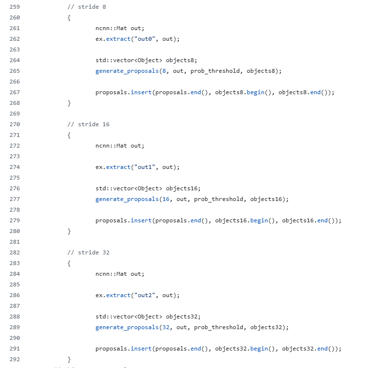
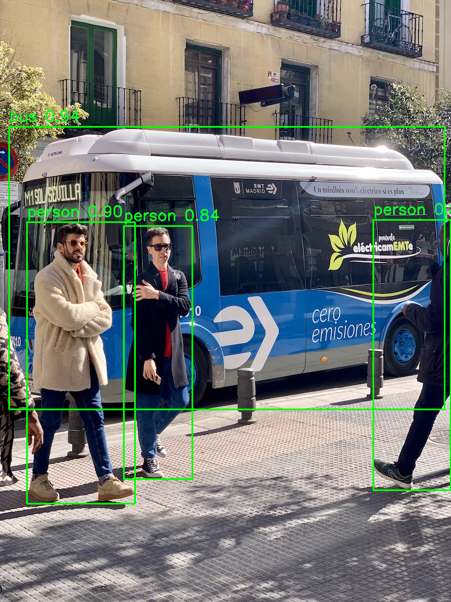

# yolo11-ncnn

use ncnn exported from ultralytics yolo11 directly, without change the code of yolo11

[English](README.md) | [中文](README.zh-CN.md)

## 1. Background


I am attempting to perform inference with an NCNN model exported from the YOLO11 model, but there is no suitable code available online. Currently, there are two pieces of code available:

- zhouweigogogo/yolo11-ncnn
- PIPIKAI/android-ncnn-yolo11

Both of these codes are based on heavily modified YOLO11 code. After the modifications, the YOLO11 model can output 3 heads, which allows for the reuse of the YOLOv8 post-processing. This kind of operation is not user-friendly for most users, as shown in the image below, with out0, out1, and out2.



However, in practice, models trained and exported directly from ultralytics do not have these three heads; they only have a consolidated out0.


We want to be able to run `yolo train`, `yolo export`, and then have it work seamlessly. 

I spent an entire day working on this. Various codes available online were of no use. I managed to find the issue by gradually debugging the official YOLO code and modified my own code. Eventually, I resolved the problem and created this project.

If you find this useful, I hope you can give it a Star.


## 2. Brief Tutorial on Training the Model
### 2.1 Setting Up the Environment (If You Haven't Already)

Install PyTorch by following the instructions on the official website: https://pytorch.org/get-started/locally/
```shell
pip3 install torch torchvision torchaudio --index-url https://download.pytorch.org/whl/cu118
```

Install Ultralytics, the core package for training models: https://docs.ultralytics.com/quickstart/#install-ultralytics

```shell
pip install ultralytics
```

### 2.2 Preparing a Dataset

If you need to train your own model, you will need to prepare a dataset. Annotating a dataset can be cumbersome, but some websites can assist with this, such as:

https://roboflow.com/

When exporting your dataset, choose the YOLO format.

### 2.3 Training the Model

After preparing your dataset, you will have a YAML file and can proceed to train your model.

```shell
yolo train --img 640 --batch 16 --epochs 100 --data data.yaml --weights yolo11n.pt
```

If you only want to experiment, you can use an official small dataset:

```shell
yolo train data=coco8.yaml model=yolo11n.pt epochs=10 lr0=0.01
```

Alternatively, if you do not wish to train a model, you can simply play around with the officially provided `yolo11n.pt` model.

### 2.4 Exporting the Model

After training, you will receive two `.pt` files: `best.pt` and `last.pt`. These files are typically located in a directory like `runs\detect\train\weights`. It is generally recommended to use `best.pt` for exporting the NCNN model.

```shell
yolo export model=path_to_yolo11n.pt format=ncnn  # creates '/yolo11n_ncnn_model'
```

For detailed instructions, refer to:

https://docs.ultralytics.com/integrations/ncnn/

## 3. Using This Project's Code

You can run the following command to perform inference with the NCNN model and an image named `bus.jpg`:

```shell
python run_ncnn.py yolo11n_ncnn_model bus.jpg
```

Then, you can view your results in `result.png`.



## 4. Additional Notes

Upon discovering that common codebases were based on heavily modified YOLO11 code, I attempted to write my own post-processing. Despite multiple attempts, I could not achieve satisfactory results. Later, I spent an entire day debugging the source code of Ultralytics. The code is highly modular, and by observing variable shapes during the debugging process and comparing them with my own code, I gradually corrected my code (also borrowing some of their code). Eventually, I was able to produce the code for this project.

I share this so that others may avoid similar pitfalls. If anyone has ported this code to C++, please send me a pull request.

Finally, I would appreciate it if you could give this project a star, so more people can see it.
