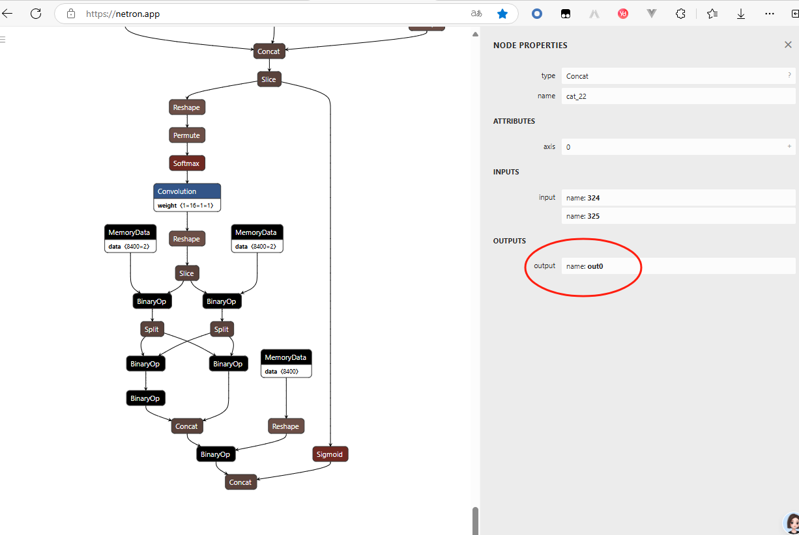

# yolo11n-ncnn

use ncnn exported from ultralytics yolo11 directly, without change the code of yolo11

[English](README.md) | [中文](README.zh-CN.md)

# 1 缘由

我在尝试将YOLO11模型导出的NCNN模型进行推理，但网上没有合适的代码。目前有的代码有两个

zhouweigogogo/yolo11-ncnn
和
PIPIKAI/android-ncnn-yolo11

这两个代码都是以魔改YOLO11代码为基础的。 经过魔改后的YOLO11模型可以输出3个头， 这样就可以复用YOLOv8的后处理。 这种操作对大多数用户不友好。如下图所示，有out0、out1和out2。


然而实际上，直接从ultralytics 训练和导出的模型，并没有这三个头,只有一个整合后的out0。




我们希望 yolo train 、 yolo export 然后就可以跑起来。 我花了一整天来做这个工作。 网上的各种代码都无用，我是通过逐步调试yolo官方代码，然后通过变量形状对比自己的代码，慢慢的找到了问题所在，并给出了这个项目。

对你有用的话希望给个Star。

# 2 训练模型简要教程
## 2.1 安装环境（如果你没有的话）

安装torch ，可以参考官网  https://pytorch.org/get-started/locally/
```shell
pip3 install torch torchvision torchaudio --index-url https://download.pytorch.org/whl/cu118

```
安装ultralytics ，这是用来训练模型的核心包 https://docs.ultralytics.com/quickstart/#install-ultralytics

```shell
pip install ultralytics
```


## 2.1 准备一个数据集

如果你需要训练自己的模型，你需要准备一个数据集。 标注数据集是一个麻烦的事，不过有一些网站可以帮助你，比如：

https://roboflow.com/

导出数据集的时候，选择yolo格式即可。


## 2.2 训练模型

准备好数据集后，你得到了一个yaml文件，然后就可以训练模型了。

```shell
yolo train --img 640 --batch 16 --epochs 100 --data data.yaml --weights yolo11n.pt
```
如果你只想测试，你可以直接使用一个官方提供的小数据集来玩一玩

```shell
yolo train data=coco8.yaml model=yolo11n.pt epochs=10 lr0=0.01
```

如果不想训练，也可以那官方提供的yolo11n.pt模型来玩一玩。


## 2.3 导出模型

训练好之后，你会得到两个.pt文件，一个best.pt一个last.pt。
这个文件一般在一个如 runs\detect\train\weights 目录下。 
一般建议使用best.pt，然后就可以导出ncnn模型了。


```shell
yolo export model=path_to_yolo11n.pt format=ncnn  # creates '/yolo11n_ncnn_model'
```

详细的教程可以看：

https://docs.ultralytics.com/integrations/ncnn/


# 3 使用本项目代码

```
python run_ncnn.py yolo11n_ncnn_model bus.jpg
````
然后你可以在result.png中看到你的结果。


# 4 废话

在我发现常见的代码都是魔改YOLO11代码的时候，我就试图自己写一个后处理。然而我写了多次也没法得到一个好的结果。后来，我花费了一整天的时间来调试ultralytics的源码。这个代码是一个高度模块化的代码，通过调试过程中观察变量的形状，和自己的代码进行对比，慢慢地修正了我自己的代码。（也借用了其中一些代码），最终才能得到了这个项目的代码。

分享出来，希望大家能够少走弯路。如果有将此代码转成c++的朋友，请发pull request给我。

最后，请大家给一个Star。 让更多的人能看到他。

